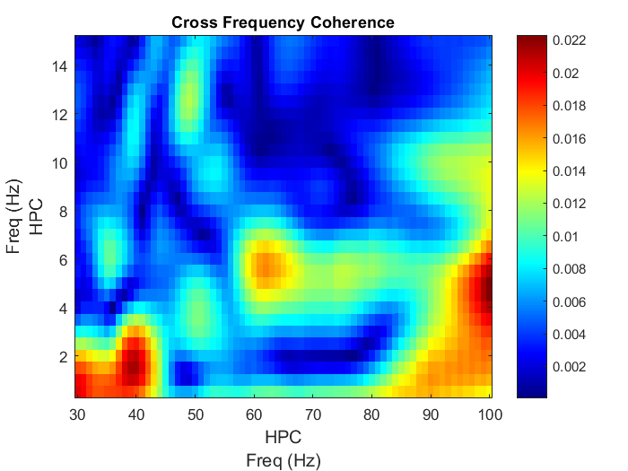
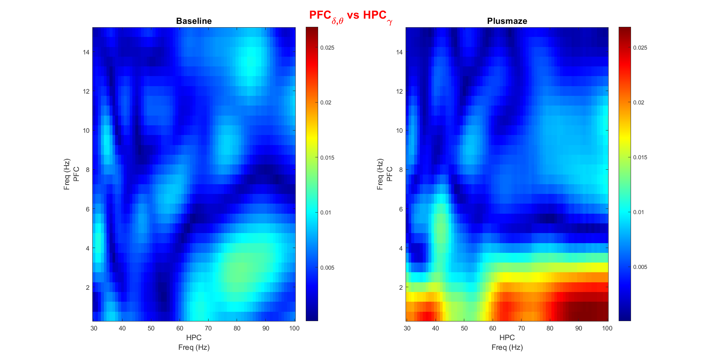

-Cross-Frequency coupling. :dizzy:
------------------
Main script is shared with Granger causality analysis main script: **granger_fig4.m**

* **crossfreq.m:**  
*Performs CFC coupling of ripple-centered epochs.* 

* **ft_crossfrequencyanalysis:**  
*Fieldtrip function used to perform CFC analysis. Methods: coh, plv, mvl and mi * 

* **pchannel.m:**  
*Extracts ripples of a specific region from p.* 

* **crossfreq_single.m:**  
*Extracts High and Low frequencies spectrums of a region to be used in further CFC analysis.* 

* **xfreq.m:**  
*Computes CFC of ripple-centered epochs after **crossfreq_single.m** .*

* **plot_cross.m:**  
*Plots results from **xfreq.m**.* 

* **cfc_print.m:**  
*Calls **xfreq.m** and **plot_cross.m** and saves figures in different formats.*

* **cfc_side.m:**  
*Plots the Baseline and Plusmaze CFC maps side by side for comparison.*

* **stats_between_cfc.m:**  
*Plots the cluster-corrected permutation statistics between the Baseline and Plusmaze CFC maps.*

* **cfc_side3.m:**  
*Plots the cluster-corrected permutation statistics between the Baseline and Plusmaze CFC maps following the maps of both conditions.*

* **simulation.m:**
*Simulation example from Fieldtrip. Obtained from [here.](http://www.fieldtriptoolbox.org/example/crossfreq/amplow_amphigh/)*

Function yet to test: pac.m from EEGLAB.  
