# List of functions used to generate Figures
------------------

## :zap: Figure 2: 

* **periodogram_without_normalization.m:**  
*Self-explainatory.* 
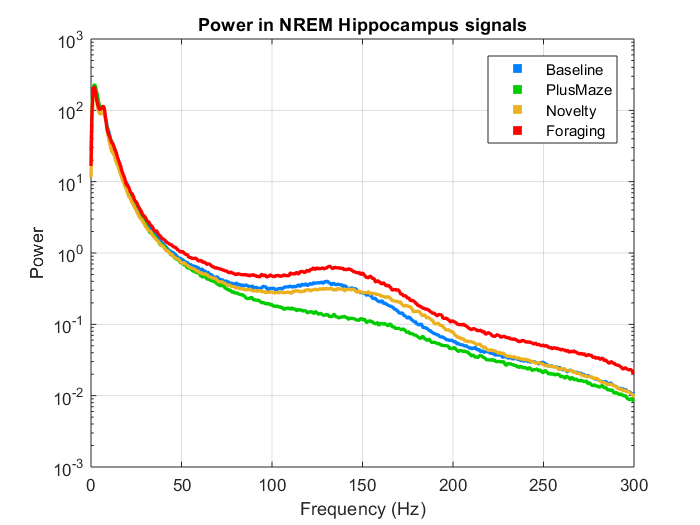

* **periodogram_without_normalization_mt.m:**  
*Updated version of the above. It uses Multitaper spectral analysis for the higher frequencies.* 

* **merge_blocks.m:**   
*Merges time blocks of periodograms.* 
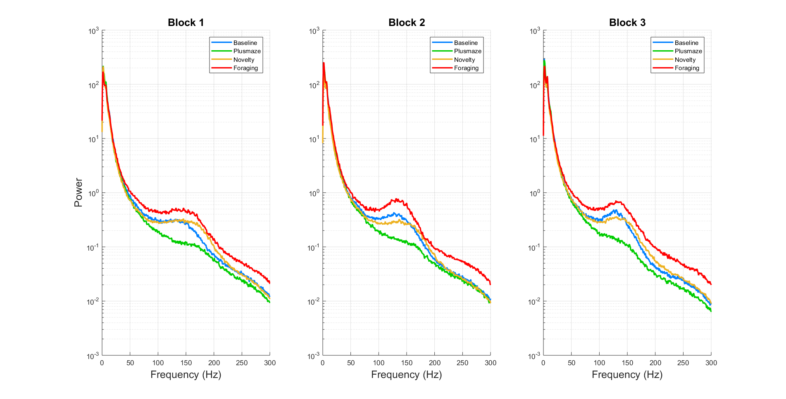

* **thr_vs_rip.m:**   
*Plots the relationship between amplitude threshold for SWR and the rate of ripple occurrence per condition.* 
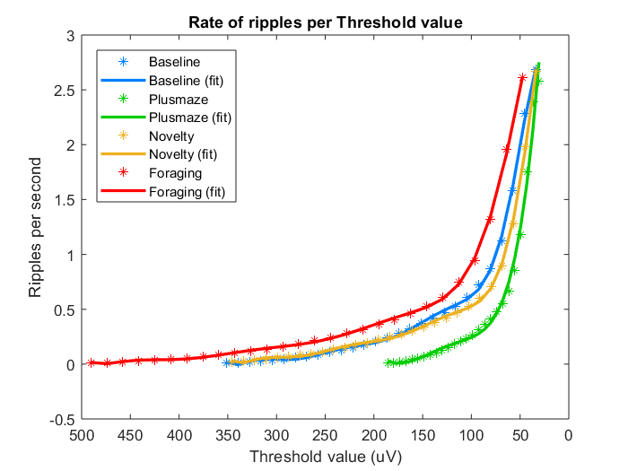

* **thr_vs_rip_vs.m:**   
*Does the same thing as the function above but using vx.mat files and different baselines.*

* **test_fix_thr.m:**
*Plots and saves the threshold vs ripple plot per rat and baseline, indicating the fixed threshold used on Method 4.*
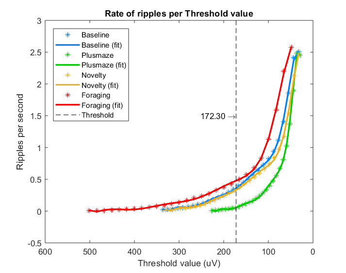

* **bars_ripples.m:**
Bar plots of the number of ripples found among conditions for a fixed baseline threshold.
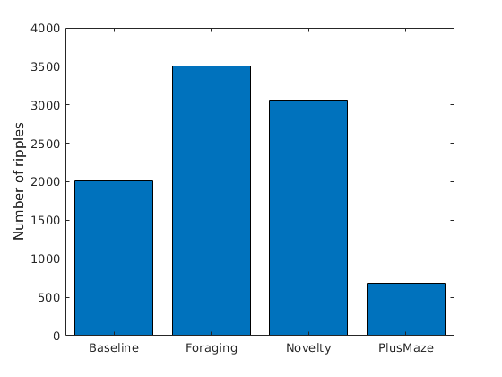

* **sleep_amount.m:**   
*Generates barplots with amount of sleep per condition.* 
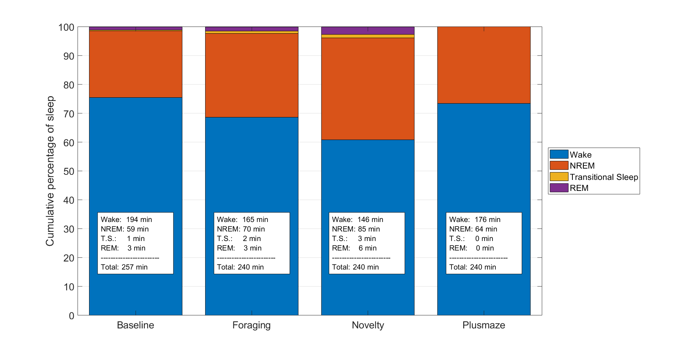

* **compare_states.m:**   
*Quantifies and displays the percentual differences between the oldest and the newests sleep scoring methods.* 
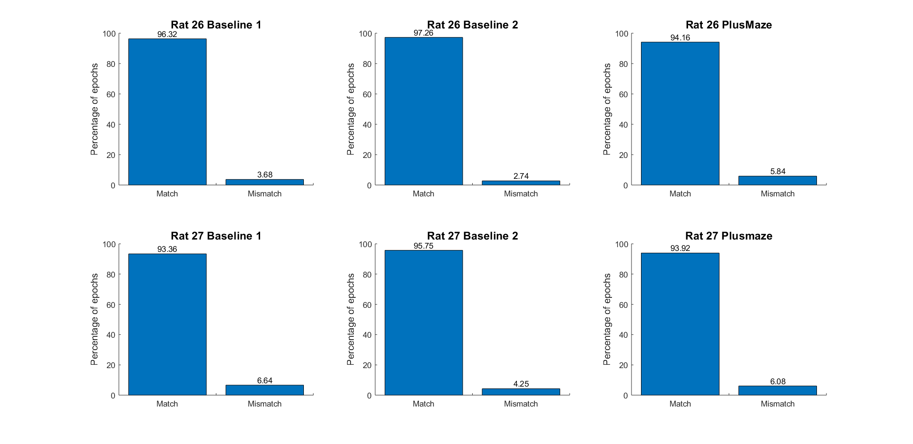

* **get_histograms.m:**
*Generates percentual histogram of interriple time between baseline and plusmaze.*
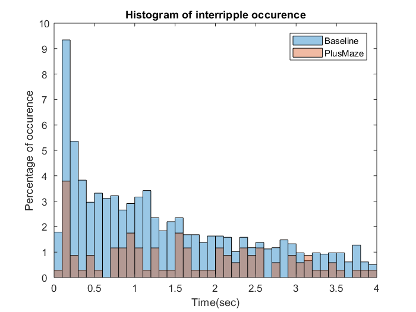

* **get_histograms_allconditions.m:** \
When ripdur=0 and tailed~=1:\
*Generates percentual histogram of interriple time between all conditions.*
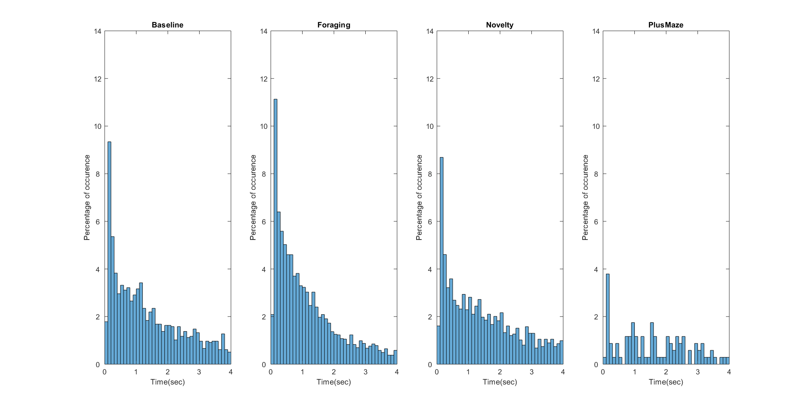

When ripdur=0 and tailed=1:\
*Generates full-tail non-normalized histogram of interriple time between all conditions.*
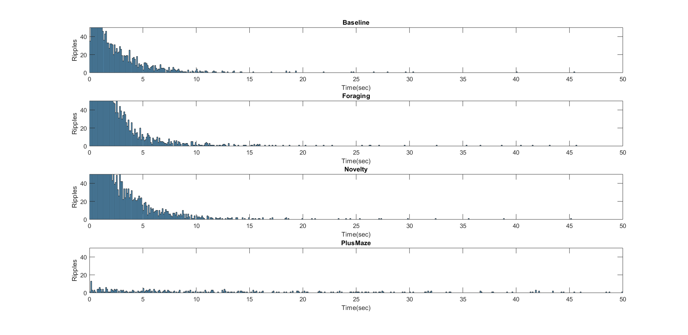

When ripdur=1: \
*Plots notched boxplots of the ripples´s duration per condition.* \
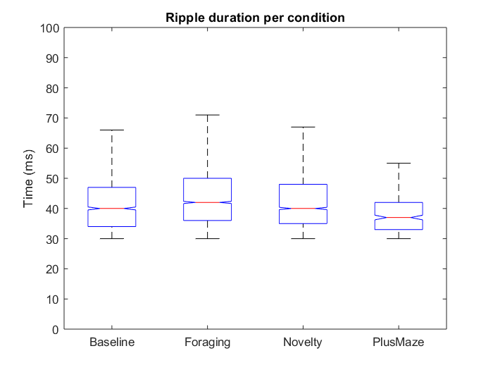

* **get_histograms_allconditions_outliers.m:** 
When ripdur=1: \
*Plots notched boxplots of the ripples´s duration per condition. Outliers are displayed.* 
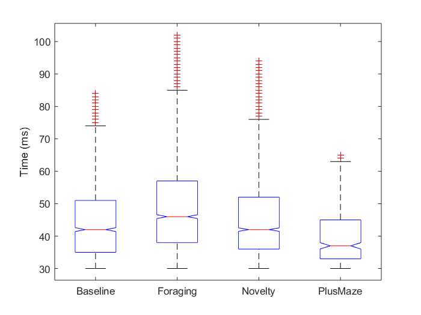
*Violin plot of skewed distributions per condition.* 
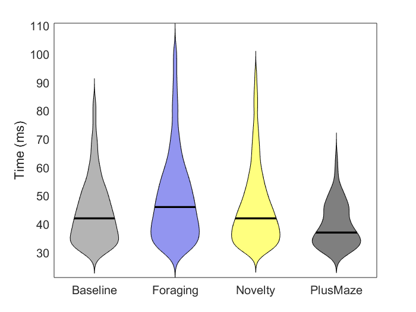

* **frequency_boxplots.m:**
*Plots notched boxplots of the ripples´s peak or mean frequency.* 
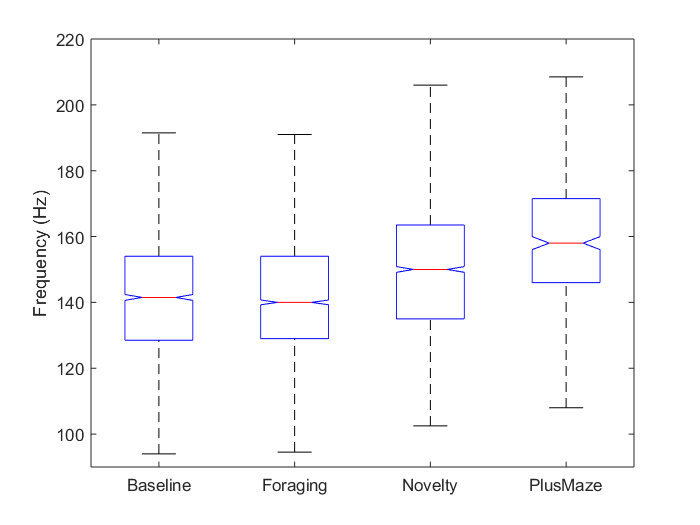

* **sleep_bouts.m:**
*Characterizes bouts for Wake, NREM, REM and transitional sleep stages*
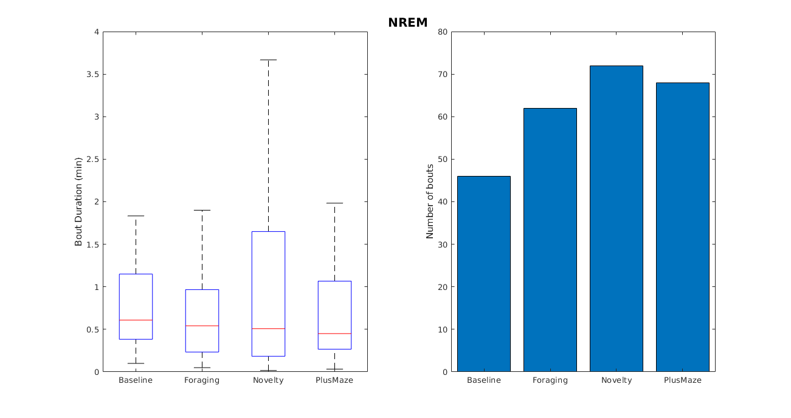

* **equal_axis.m:**
*Equalizes axes among boxplots for different rats.*
