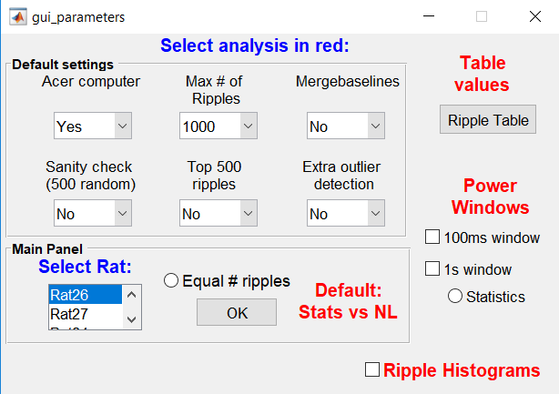
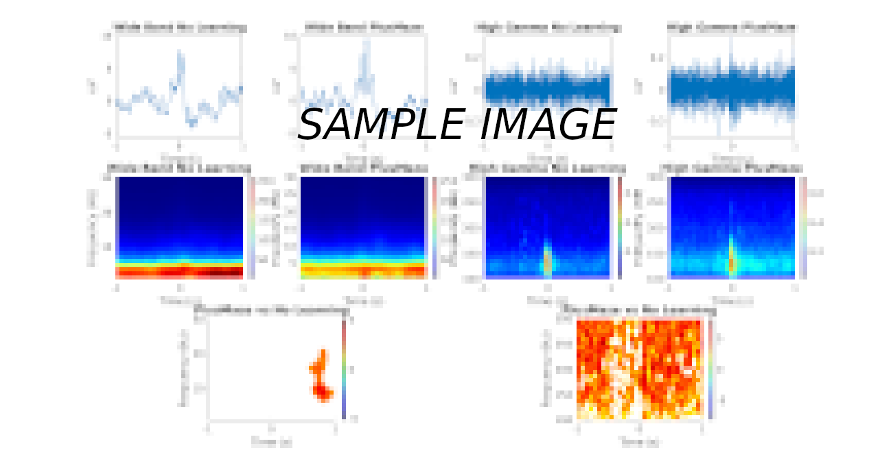

## :zap: Controls for spectrograms.

1. **sanity=1:**
*This control test consists on selecting the same n random number of ripples among conditions. Since Plusmaze generates less ripples, this condition defines the value of n.*

2. **quinientos=1:**
*Similar to control above but this one makes sure to take the top 500 ripples instead of their random version. Could be more vulnerable to outliers.*

3. **outlie=1:**
*The use of this control activates a more agressive detection of outliers.*

## :zap: Figure 3
* **spectrogram_working_version.m:**
*Best version up to Feb 2019.* :heavy_check_mark:

* **spectrogram_without_normalization.m:**
*Generates non-normalized spectrograms on the wideband and bandpassed signals for different conditions, durations and window sizes.*

* **spectra_window.m:**
*Plots power windows for all conditions and regions.* :heavy_check_mark:

* **table_values.m:**
*Generates table with average value per condition, per brain area.* :heavy_check_mark:

* **Poster_main_optimized:**
*Generates non-normalized spectrograms and statistical tests using the complete recordings.*

* **fixed_threshold.m:**
*Initial test ran to try the fixed_threshold approach. Later merged with spectrogram_withouth_normalization.m*

* **testing_loop.m:**
*Loop ran to observe that the folder names generated followed the correct order.*

* **spec_skipto_high.m:**
*Calls .fig files and replaces wrong stats for High Gamma power spectrograms.*
* **plot_inter_conditions_33_high.m:**
*Corrected version of plot_inter_conditions_33, using an improved method to generate the stats.* (Update 25/08: Not suitable for further figure improvement. Best to run: *plot_inter_conditions_33* followed by *plot_inter_high_improve*).
* **plot_inter_high_improve.m:**
*Adaptation of plot_inter_conditions_33_high, only computing the High Gamma spectrograms*
* **plot_inter_conditions_33.m:**
*Best version up to Feb/2019. Use this one.* :heavy_check_mark:
* **colorbar_among_conditions.m:**
*Equalizes the colorbar ranges among conditions for a specific brain area*

####  :link: Post-Processing steps for spectrograms: 
Simply run this function:

**post_spectro.m** :heavy_check_mark:

Based on the following steps:
####  Post-Processing steps for spectrograms (19-9-18):
Leaves spindles visualization RAW.

1. **colorbar_among_conditions2.m:**
*Equal colorbar range among conditions.*

2. **axis_among_conditions2.m:**
*Equal Y-axis for traces among conditions.*

3. **same_axis2.m:**
*Equal Y-axis and colorbar among brain areas.*
