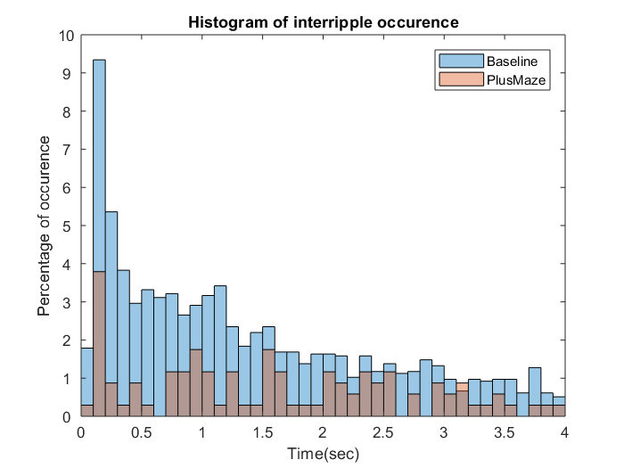
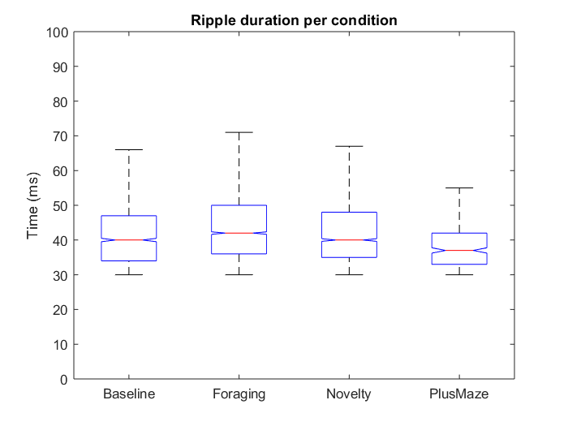

-List of functions used to generate Figures
------------------

:zap: Figure 2: 

* **periodogram_without_normalization.m:**  
*Self-explainatory.* 

* **merge_blocks.m:**   
*Merges time blocks of periodograms.* 

* **thr_vs_rip.m:**   
*Plots the relationship between amplitude threshold for SWR and the rate of ripple occurrence per condition.* 

* **thr_vs_rip_vs.m:**   
*Does the same thing as the function above but using vx.mat files and different baselines.*

* **sleep_amount.m:**   
*Generates barplots with amount of sleep per condition.* 

* **compare_states.m:**   
*Quantifies and displays the percentual differences between the oldest and the newests sleep scoring methods.* 

:zap: Figure 3:

* **Poster_main_optimized:**
*Generates non-normalized spectrograms and statistical tests using the complete recordings.*

* **spectrogram_without_normalization.m:**
*Generates non-normalized spectrograms on the wideband and bandpassed signals for different conditions, durations and window sizes.*

* **spec_loop_improve.m:**
*Calls .fig files with non-normalized spectrograms and changes color scaling settings to improve visualization of spindles.*

* **test_fix_thr.m:**
*Plots and saves the threshold vs ripple plot per rat and baseline, indicating the fixed threshold used on Method 4.*

* **fix_threshold.m:**
*Initial test ran to try the fixed_threshold approach. Later merged with spectrogram_withouth_normalization.m*

* **testing_loop.m:**
*Loop ran to observe that the folder names generated followed the correct order.*

* **bars_ripples.m:**
Bar plots of the number of ripples found among conditions for a fixed baseline threshold.

* **spec_skipto_high.m:**
*Calls .fig files and replaces wrong stats for High Gamma power spectrograms.*
* **plot_inter_conditions_33_high.m:**
*Corrected version of plot_inter_conditions_33, using an improved method to generate the stats.* (Update 25/08: Not suitable for further figure improvement. Best to run: *plot_inter_conditions_33* followed by *plot_inter_high_improve*).
* **plot_inter_high_improve.m:**
*Adaptation of plot_inter_conditions_33_high, only computing the High Gamma spectrograms*
* **stats_high.m:**
*Computes statistics on the high frequency spectrograms.*

* **colorbar_among_conditions.m:**
*Equalizes the colorbar ranges among conditions for a specific brain area*

* **get_histograms.m:**
*Generates percentual histogram of interriple time between baseline and plusmaze.*

* **get_histograms_allconditions.m:** \
When ripdur=0 and tailed~=1:\
*Generates percentual histogram of interriple time between all conditions.*

When ripdur=0 and tailed=1:\
*Generates full-tail non-normalized histogram of interriple time between all conditions.*

When ripdur=1: \
*Plots notched boxplots of the ripples´s duration per condition.* \

* **get_histograms_allconditions_outliers.m:** 
When ripdur=1: \
*Plots notched boxplots of the ripples´s duration per condition. Outliers are displayed.* 

*Violin plot of skewed distributions per condition.* 

* **frequency_boxplots.m:**
*Plots notched boxplots of the ripples´s peak or mean frequency.* 

* **sleep_bouts.m:**
*Characterizes bouts for Wake, NREM, REM and transitional sleep stages*

* **equal_axis.m:**
*Equalizes axes among boxplots for different rats.*

####  :link: Post-Processing steps for spectrograms: 

1. **spec_loop_improve.m:**
*Visualizes spindles.*

2. **spec_skipto_high.m:**
*High frequency statistics.*

3. **colorbar_among_conditions.m:**
*Equal colorbar range among conditions.*

4. **axis_among_conditions.m:**
*Equal Y-axis for traces among conditions.*

5. **same_axis.m:**
*Equal Y-axis and colorbar among brain areas.*

:zap: Figure 4:

* **granger_fig4.m:**
*Main file to generate granger causality figures (Work in progress)*

