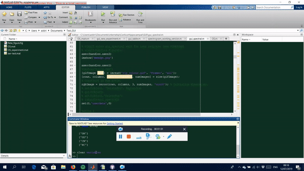
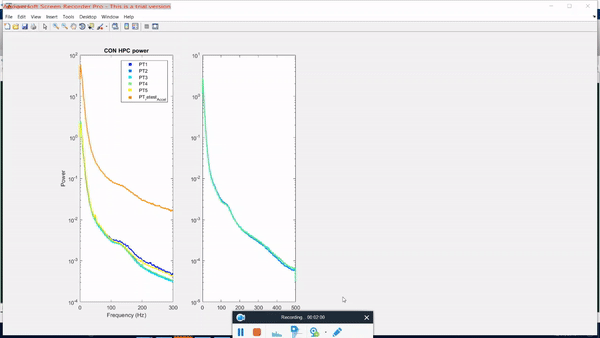

# Spectral analysis GUI :crystal_ball:

To start the GUI please type:
```matlab
gui_spectral
```

# Table of content

 * File
   * New experiment. :heavy_check_mark:
   * Load experiment. :heavy_check_mark:
   * Load Ephys data.
   * Load Matlab data.
   * Save Figure.
   * Exit GUI. :heavy_check_mark:
   
 * Preprocessing
   * Downsample data.
   * Extract labelled stages.
   * Filter data.
 
 * SWR detection
   * Threshold plots. :heavy_check_mark:
   * Run detection. 
   * Ripple Selection.
 
 * Data description
   * Sleep amount. :heavy_check_mark:
   * Ripples amount. 
   * Hypnogram.
 
 * Spectral analysis
   * Periodogram. :heavy_check_mark:
   * Spectrogram. 
   * Granger causality.
 
 * Help
   * Github. :heavy_check_mark:
   * MemoryDynamics. :heavy_check_mark:
          
# Videos 
<!--- 
PART 1
<p align="center">

</p>
PART 2
<p align="center">

</p>
PART 3
<p align="center">

</p>
 --->

<!--- --->

Unlisted videos on Youtube:

[Periodogram DEMO](https://www.youtube.com/watch?v=TUbLwjfCAMI&feature=youtu.be)

[Sleep stages](https://www.youtube.com/watch?v=KMN62T7EluY&feature=youtu.be)

[Ripple thresholds](https://www.youtube.com/watch?v=IMpiQVgEH4g&feature=youtu.be)

