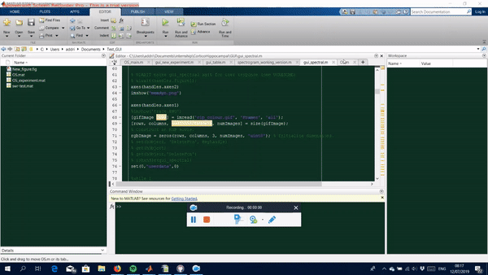

# Spectral analysis GUI :crystal_ball:

To start the GUI please type:
```matlab
gui_spectral
```

# Table of content

 * File
   * New experiment. :heavy_check_mark:
   * Load experiment. :heavy_check_mark:
   * Exit GUI. :heavy_check_mark:

 * Preprocessing
   * Downsample data. :heavy_check_mark:
   * Add sleep scoring files.  :heavy_check_mark:
   * Check sleep scoring.  :heavy_check_mark:

 * Data description
   * Sleep amount. :heavy_check_mark:
   * Hypnogram. :heavy_check_mark:
   * Ripples amount. 
   
 * Spectral analysis
   * Periodogram. :heavy_check_mark:
   * Spectrogram. 
   * Granger causality.   
   
 * SWR detection
   * Threshold plots. :heavy_check_mark:
   * Run detection. 
   * Ripple Selection.
   
 * Help
   * Github. :heavy_check_mark:
   * MemoryDynamics. :heavy_check_mark:

# Pipeline of methods:

1. Define a new experiment and/or load it.
2. Downsample data and store.
3. Add sleep scoring files and check they match the data length.
4. Data description.
   * Sleep stages.
   * Periodograms.
   * Ripple thresholds.
5. Traces visualization & threshold selection.
6. Event-related spectrograms.
7. Granger causality.
 
# How Ephys data is organized (From general to specific):

OS data:
1. Rat ID.
2. Condition.
3. Trial.
4. Channels.

Plusmaze data:
1. Rat ID.
2. Trial.
3. Channels.


# Videos 
<!--- 
PART 1
<p align="center">

</p>
PART 2
<p align="center">

</p>
PART 3
<p align="center">

</p>
 --->

<!--- --->

Unlisted videos on Youtube:

[Periodogram DEMO](https://www.youtube.com/watch?v=TUbLwjfCAMI&feature=youtu.be)

[Downsampling ephys signals into matlab files](https://youtu.be/vtYHah4QgTg)

[Sleep stages](https://www.youtube.com/watch?v=KMN62T7EluY&feature=youtu.be)

[Ripple thresholds](https://www.youtube.com/watch?v=IMpiQVgEH4g&feature=youtu.be)

[Irene's PC directories](https://www.youtube.com/watch?v=zP2UaCQGjFA&feature=youtu.be)
