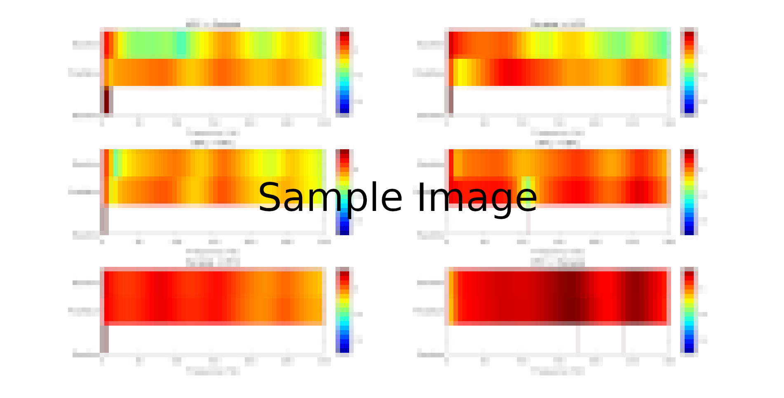
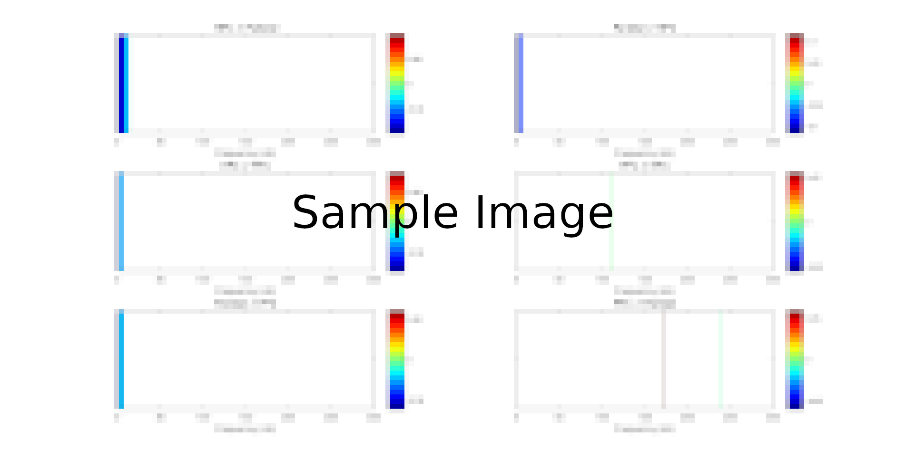
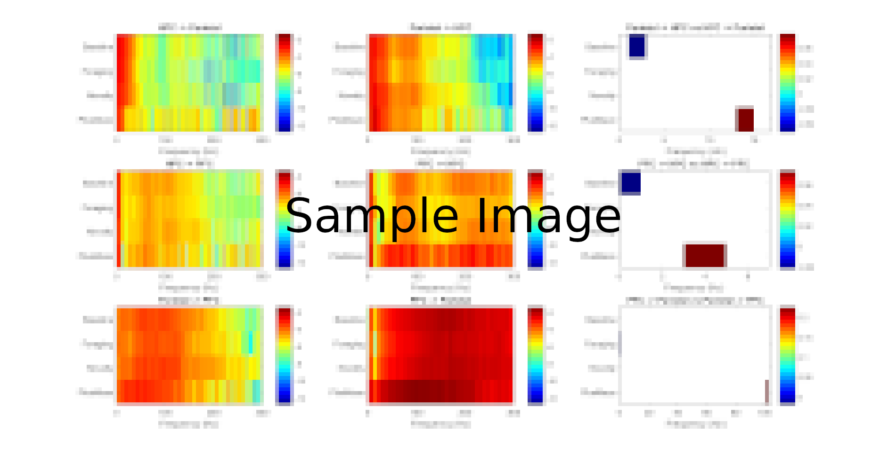
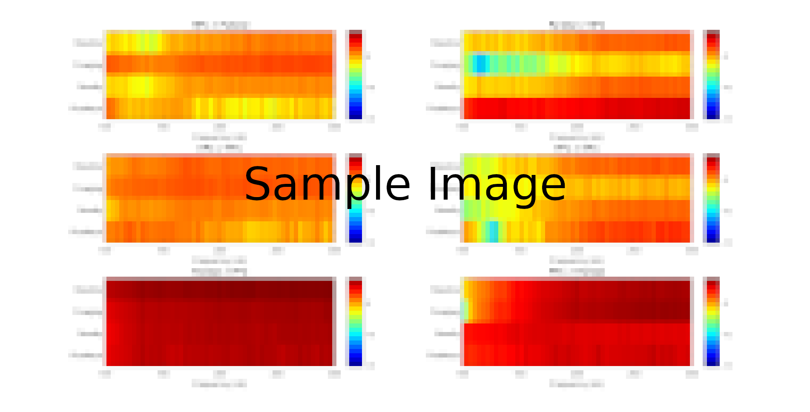
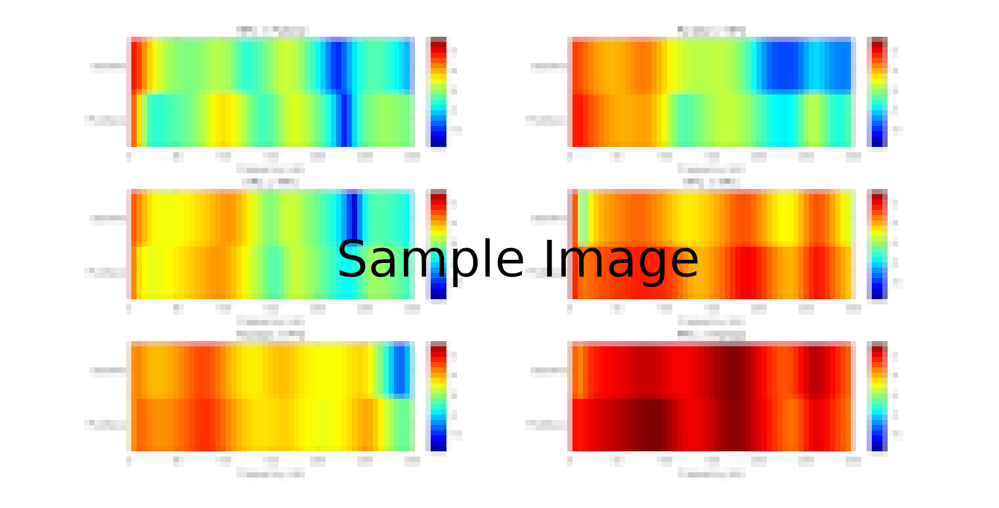
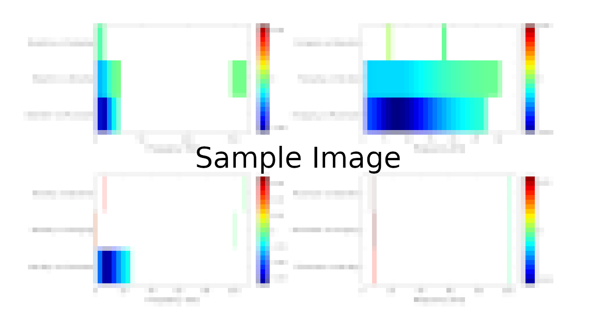
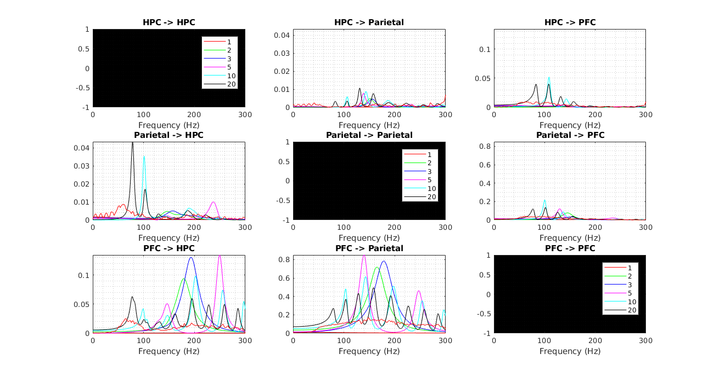
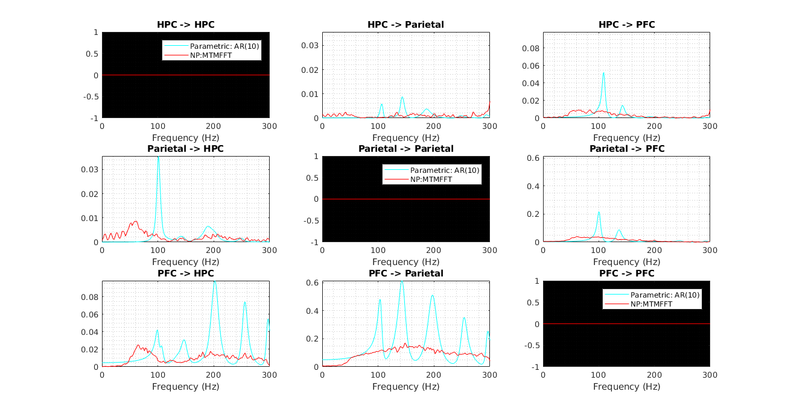

-Spectral Granger Causality 
------------------

* **granger_2D_baseplus_stats.m:**  
*Prints 2D Granger for Baseline and Plusmaze plus their bootstrapped statistics.* 
     

* **granger_2D_baseplus_stats_only.m:**  
*Prints the bootstrapped statistics between Baseline and Plusmaze.* 
     

* **granger_2D_testall.m:**  
*Visualizes Granger causality as images to later compute their pixel-based statistics.* 
     

* **granger_2D_testall_nostats.m:**  
*Visualizes Granger causality as images among conditions without stats.* 
     

* **granger_2D_baseplus_nostats.m:**  
*Visualizes Granger causality as images among baseline and plusmaze without stats.* 
     

* **granger_2D_stats_conditions.m:**  
*Visualizes Granger causality pixel-based statistics among conditions.* 
     

* **autotest.m:**  
*Plots granger causality for different model order values to observe their variation. Makes use of **createauto.m*** 
     
 
 * **autotest_single.m:**  
*Plots granger causality for the non-parametric and parametric models.*
     

:notebook:  Borrowed functions from: [Fieldtrip](http://www.fieldtriptoolbox.org/tutorial/connectivity) , [BSMART](http://www.brain-smart.org/) and [MVGC](https://users.sussex.ac.uk/~lionelb/MVGC/html/mvgchelp.html)

