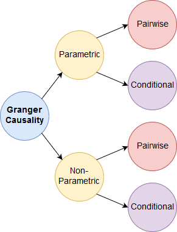
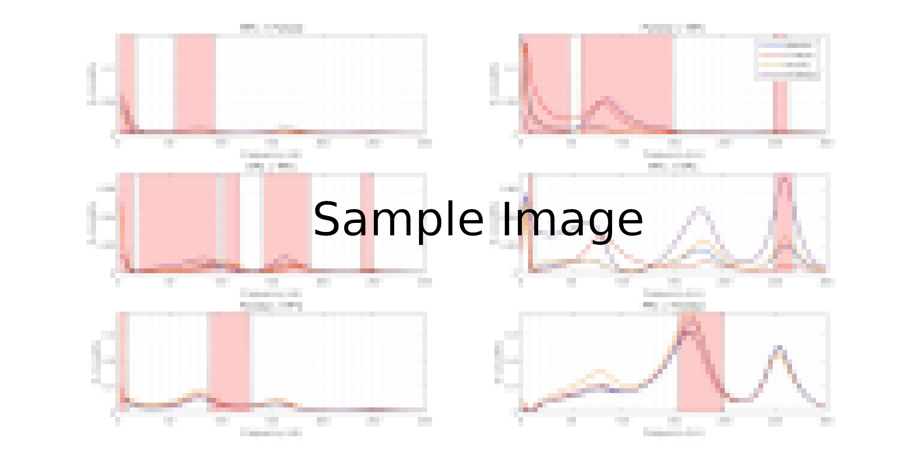
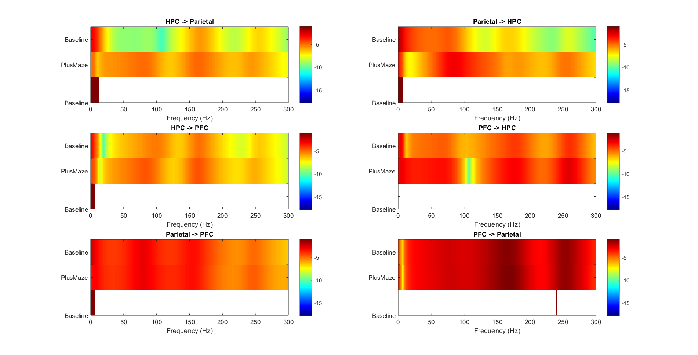
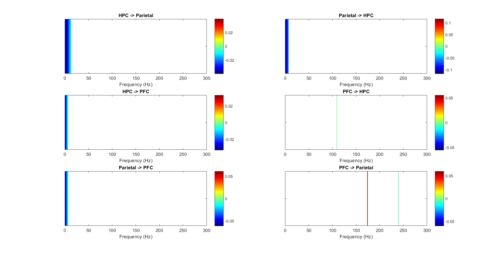
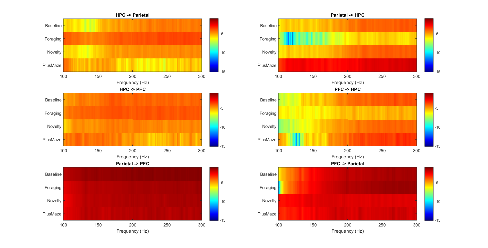
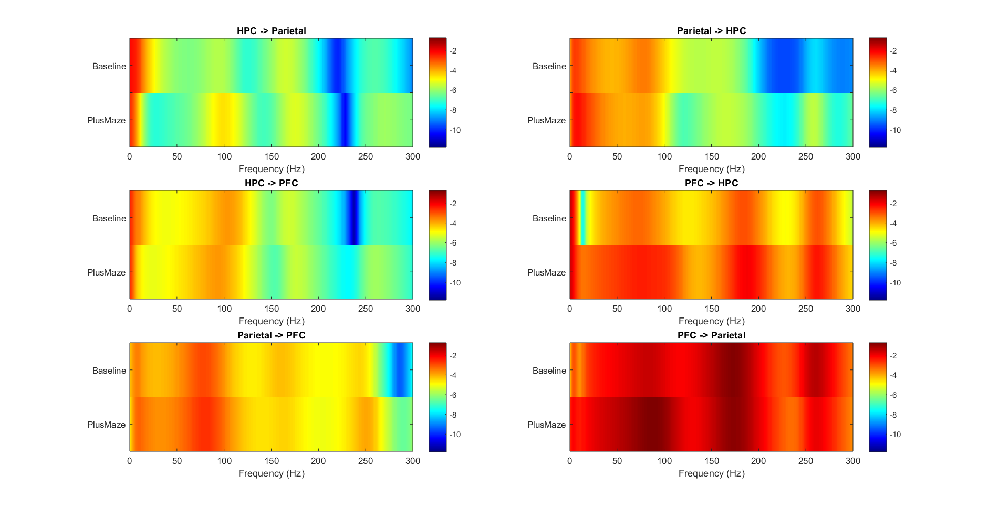
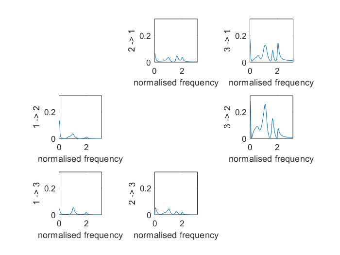

-Spectral Granger Causality 
------------------
Different types of Granger causality:

## **Parametric:**
The parametric approach assumes a model for the k neural signals, which are typically modeled as bivariate linear AR time series plus a noise term. 
This method requires the estimation of the AR coefficients , the noise covariance matrix  and a selection of the model order.

* **createauto.m:**  
*Computes _parametric_ spectral granger causality.* 

####  :link: Steps to generate Spectral GC   _(Parametric approach)_: 

1. *MVAR-modelling: Order Selection.* 
 
     **tsdata_to_infocrit.m: MVGC-based function. Computes and selects AIC and BIC up to a specified maximum order. **

2. *MVAR-modelling: Implementation.*

    **ft_mvaranalysis.m: Fieldtrip implementation of BSMART.**

3. *Frequency domain conversion of MVAR.*

    **ft_freqanalysis.m: Fieldtrip function.**

3. *Computing Spectral Granger Causality.*

    **ft_connectivityanalysis.m: Fieldtrip function.**

5. *Statistical Analysis.*

    **stats_thesis.m: Kruskal-Wallis test.**

Steps 3 to 4 contained in function: **gc_paper.m** (Conditional). Similar implementation on **fieldtrip_adapted.m** (Pairwise) Use this one preferably.

Steps 5: Kruskal-Wallis Statystical Test. 

## **Non-Parametric:**
A non-parametric method using a Multitaper frequency analysis can also be used to estimate the spectral matrix and compute the spectral causality of the signals.

* **createauto_np.m:**  
*Computes _non-parametric_ spectral granger causality.* 

### :zap: Plotting functions: 

* **granger_paper3.m:**  
*Plots spectral granger causality among brain regions for a single condition.* 
      

* **granger_paper4.m:**  
*Plots spectral granger causality among brain regions for all conditions.* 
      

* **granger_paper4_with_stripes.m:**  
*Plots spectral granger causality among brain regions for all conditions with their significant frequency bands.* 
      
* **granger_paper4_with_stripes_dual.m:**  
*Same as above but with only learning and Control conditions.*       
* **granger_paper4_stripes.m:**  
*Same as above but used for permutation test.* 

* **granger_paper4_row.m:**  
*Prints granger causality per row to use on _LaTeX_.* 

* **granger_2D_baseplus_stats.m:**  
*Prints 2D Granger for Baseline and Plusmaze plus their bootstrapped statistics.* 
     

* **granger_2D_baseplus_stats_only.m:**  
*Prints the bootstrapped statistics between Baseline and Plusmaze.* 
     

* **granger_2D_testall.m:**  
*Visualizes Granger causality as images to later compute their pixel-based statistics.* 
     

* **granger_2D_testall_nostats.m:**  
*Visualizes Granger causality as images among conditions without stats.* 
     

* **granger_2D_baseplus_nostats.m:**  
*Visualizes Granger causality as images among baseline and plusmaze without stats.* 
     

* **granger_2D_stats_conditions.m:**  
*Visualizes Granger causality pixel-based statistics among conditions.* 
     

* **autotest.m:**  
*Plots granger causality for different model order values to observe their variation. Makes use of **createauto.m*** 
     
 
 * **autotest_single.m:**  
*Plots granger causality for the non-parametric and parametric models.*
     

* **granger_baseline_learning.m:**  
*Plots S-GC for Learning and Non-learning.* 

* **granger_baseline_learning_stats.m:**  
*Plots S-GC for Learning and Non-learning with significant statistics (Used on Thesis).* 

Other:

* **gc_stripes.m:**  
*Visualizes previously calculated GC values and the significant frequency stripes for all directions. Used on the permutation statistical approach.* 

* **pal_test_ft_granger_cond.m:**
*Test function used to implement CONDITIONAL Granger Causality.*

-plot_field.m

-Granger_bootstrap_ripple.m

## :zap: MVGC-based functions: 
* **mvgc_adapted.m:**  
*Function to compute parametric spectral granger causality per ripple using MVGC. Gives very similar results to **fieltrip_adapted.m** with a different scaling due to "in the box" preprocessing.* 

* **plot_spw.m:**  
*Useful function to plot all GC combinations. For Fieldtrip inputs use as: plot_spw(rot90(fliplr(A))) or use **plot_spw2.m*** 
    

:notebook:  Borrowed functions from: [Fieldtrip](http://www.fieldtriptoolbox.org/tutorial/connectivity) , [BSMART](http://www.brain-smart.org/) and [MVGC](https://users.sussex.ac.uk/~lionelb/MVGC/html/mvgchelp.html)

