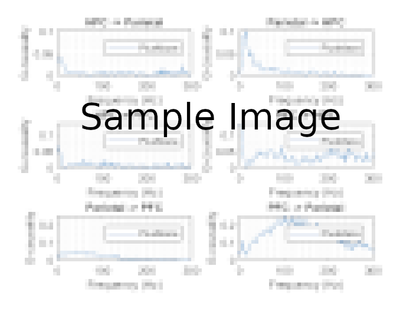

-Spectral Granger Causality 
------------------

####  :link: Steps to generate Spectral GC   _(Parametric approach)_: 

1. *MVAR-modelling: Order Selection.* 
 
     **tsdata_to_infocrit.m: MVGC-based function. Computes and selects AIC and BIC up to a specified maximum order. **

2. *MVAR-modelling: Implementation.*

    **ft_mvaranalysis.m: Fieldtrip implementation of BSMART.**

3. *Frequency domain conversion of MVAR.*

    **ft_freqanalysis.m: Fieldtrip function.**

3. *Computing Spectral Granger Causality.*

    **ft_connectivityanalysis.m: Fieldtrip function.**

5. *Statistical Analysis.*

    **function.m:**

Steps 3 to 4 contained in function: **gc_paper.m**
Steps 1 and 5: Work in progress. 

### :zap: Useful functions: 

* **granger_paper3.m:**  
*Plots spectral granger causality among brain regions for a single condition.* 

* **granger_paper4.m:**  
*Plots spectral granger causality among brain regions for all conditions.* 

* **granger_2D_testall.m:**  
*Visualizes Granger causality as images to later compute their pixel-based statistics.* 

* **granger_2D_stats_conditions.m:**  
*Visualizes Granger causality pixel-based statistics among conditions.* 

* **autotest.m:**  
*Plots granger causality for different model order values to observe their variation. Makes use of **createauto.m*** 
 
 
 * **autotest_single.m:**  
*Plots granger causality for the non-parametric and parametric models.*
 

* **createauto.m:**  
*Computes _parametric_ spectral granger causality.* 

## :zap: MVGC-based functions: 
* **mvgc_adapted.m:**  
*Function to compute parametric spectral granger causality per ripple using MVGC. Gives very similar results to **fieltrip_adapted.m** with a different scaling due to "in the box" preprocessing.* 

* **plot_spw.m:**  
*Useful function to plot all GC combinations. For Fieldtrip inputs use as: plot_spw(rot90(fliplr(A))) or use **plot_spw2.m*** 

:notebook:  Borrowed functions from: Fieldtrip, BSMART and MVGC.  
