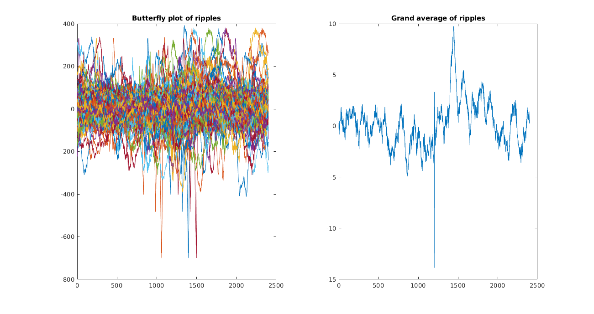
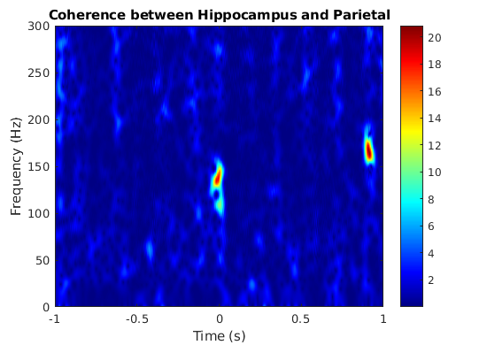

# Testing Ideas

**spectrogram_ripple.m**: Computes and plots the spectrograms of the hippocampal ripples found under different conditions.

**filter_ripples.m**: Filters power noise on high frequency bands. Results in a clean spectrogram. 

**spec_improve.m**: Replaces old spectrogram and improves visualization of power. UPDATE: BASELINE contrast is wrong. Don't use.

**butterfly_plot.m**: Generates butterfly plot of all ripples and their grand average.

**ripple_periodogram.m**
Justifies the lack of filtering on the lower frequencies. Verifies that visual artifacts at 15Hz are not due to the signal. 

**coherence_test.m**
Function used to test time-frequency coherency among brain signals.

**CPSD_plots.m**
Computes the Cross Power Spectral Density between original signal and signal with removed ripples. 

## RIPPLE REMOVAL IDEA

NORIPPLE_nrem_newest_only_ripple_level.m
