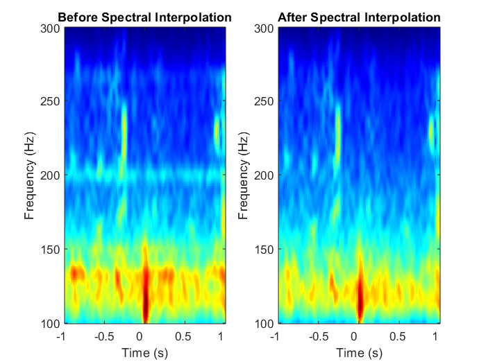
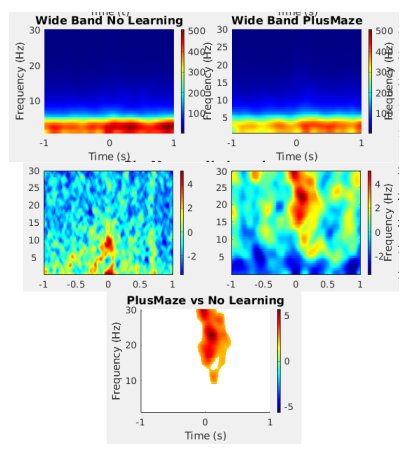

# Testing Ideas

**spectrogram_ripple.m**: Computes and plots the spectrograms of the hippocampal ripples found under different conditions.

**filter_ripples.m**: Filters power noise on high frequency bands. Results in a clean spectrogram. 

**spec_improve.m**: Replaces old spectrogram and improves visualization of power. 

