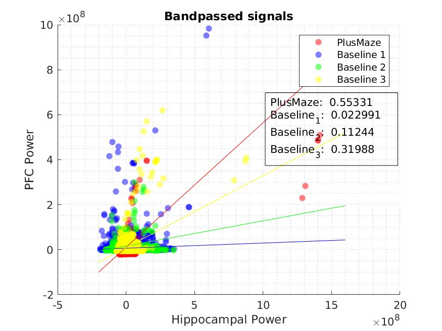

-SCATTER PLOTS
--------------
**psd_ripples.m:** Generates scatter plots to show difference between spectral power among conditions wrt the hippocampal power. 

**psd_ripples2.m:** Same but using bandpassed signals of PAR and PFC.

**psd_ripples3.m:** Same but using Wideband signals of PAR and PFC.

