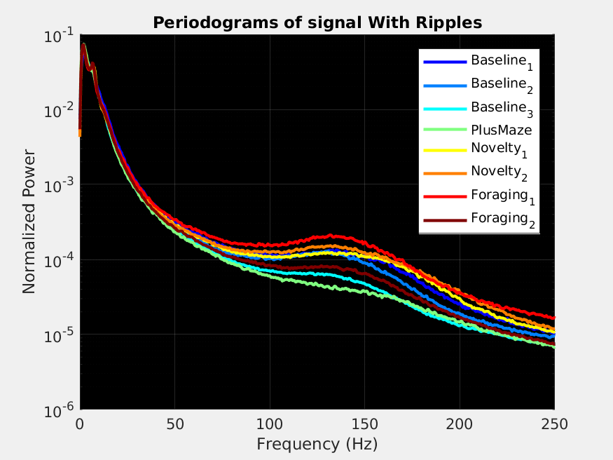
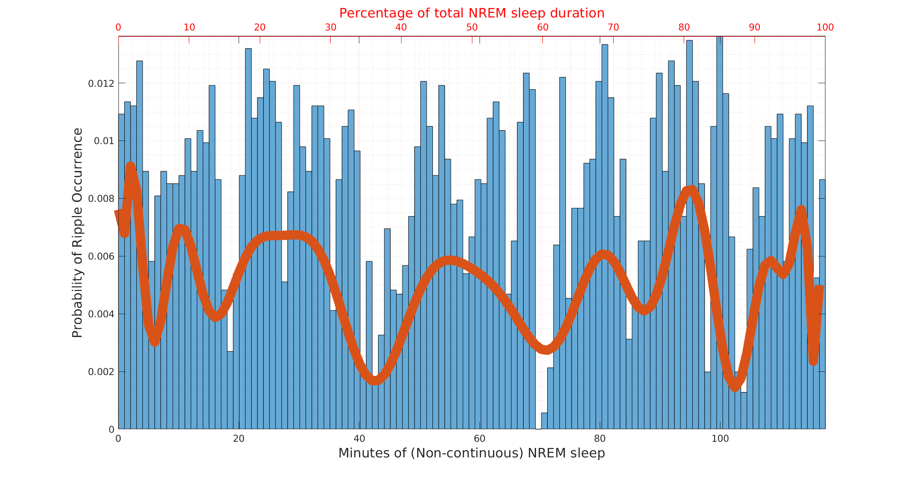
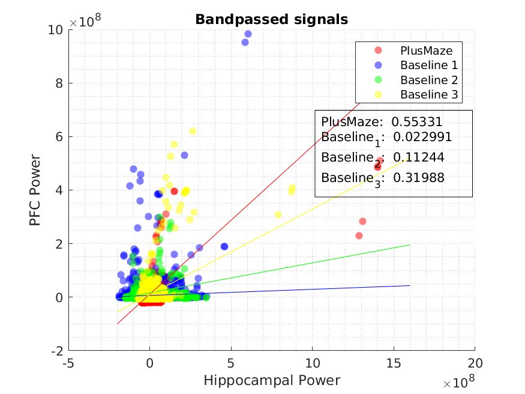
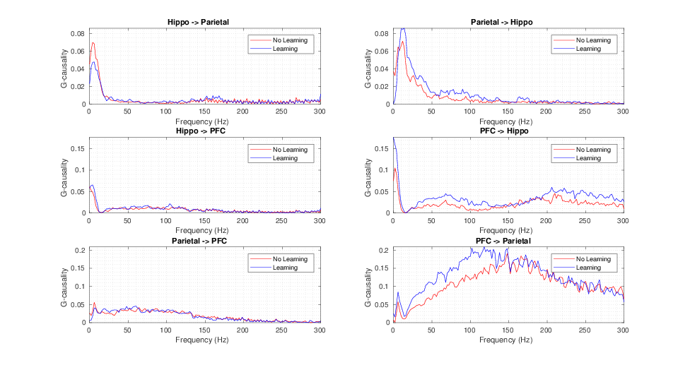
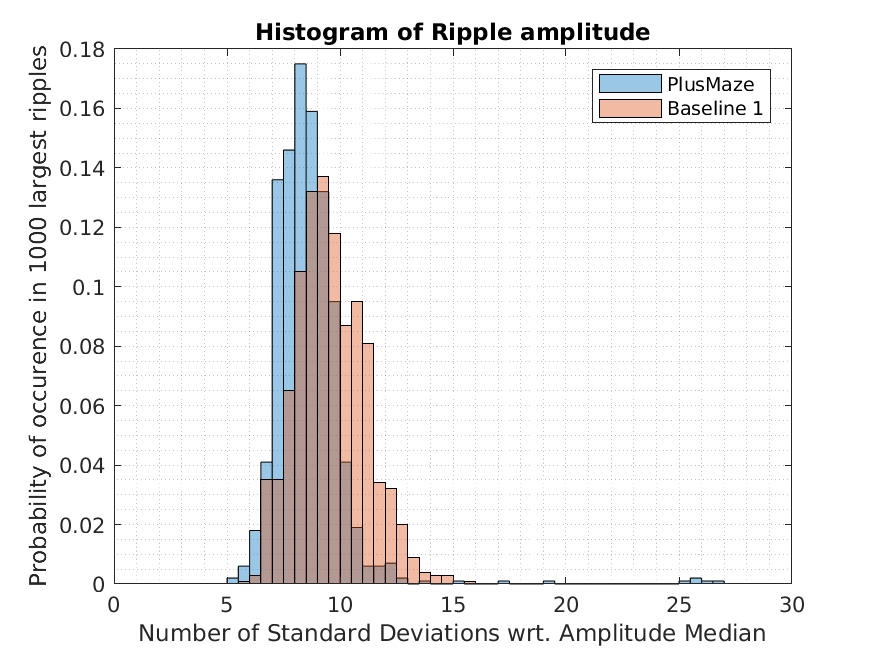
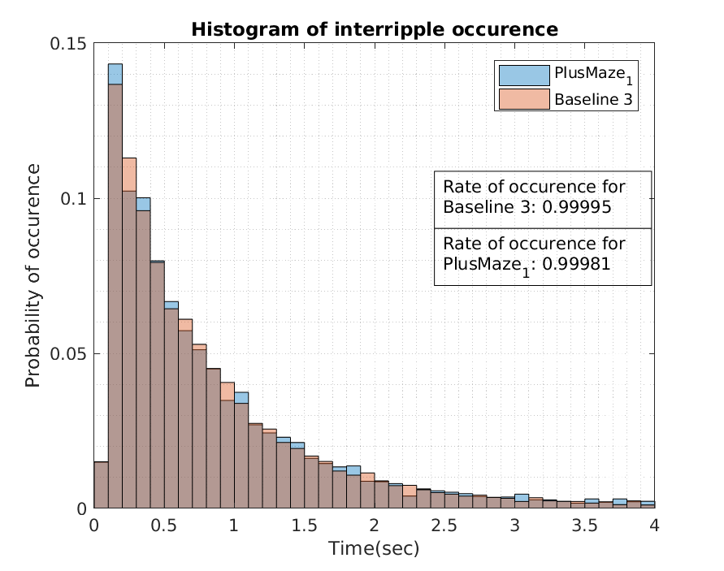
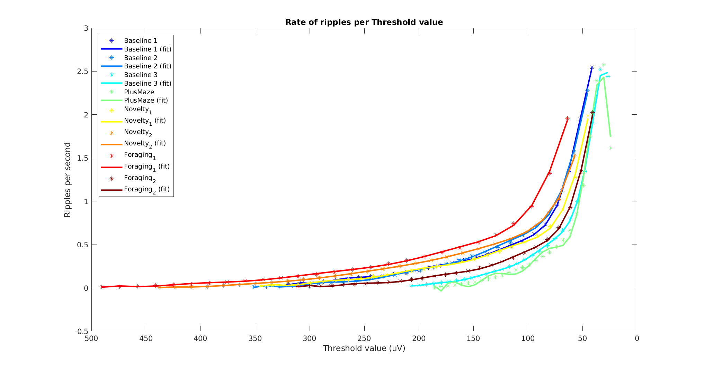

# CorticoHippocampal Networks during Memory Consolidation  

MASTER THESIS PROJECT by: Adrián Alemán 

*Due on: Late October 2018*

Half-way presentation:
https://github.com/Aleman-Z/CorticoHippocampal/blob/master/midterm-project-presentation-4.pdf
<!--- --->

--------------------------------
:zap: DESCRIPTION of MAIN FUNCTIONS:

-PERIODOGRAMS
---------------

**psd_epochs_intraconditions.m:** Generates Power plots of NREM signals for all conditions in a specific brain area. 

**psd_epochs_intraregions.m:** Generates Power plots of NREM signals for all brain areas during a specific condition. 

**nrem_newest_power.m:** Loads data in a suited fashion to generate periodograms without powerline artifacts. Notch filtering is performed outside and after running this function. 

<!------>

-DATA DESCRIPTION
-----------------
**time_of_sleep.m:** Gives information per condition about amount of sleep, number of ripples found, threshold values, and rate of occurence.
 
**plot_number_ripples.m:** Plots information obtained from the above function. 

**testing_nrem_length.m:** Generates variables ready to plot NREM length among conditions. 

**ripple_distribution.m:** Generates histograms of ripple occurrence with respect to the NREM (discontinuous) time. The data is later used to fit a polynomial. 

-SCATTER PLOTS
--------------
**psd_ripples.m:** Generates scatter plots to show difference between spectral power among conditions wrt the hippocampal power. 

**psd_ripples2.m:** Same but using bandpassed signals of PAR and PFC.

**psd_ripples3.m:** Same but using Wideband signals of PAR and PFC.

-SPECTROGRAMS AND GC
--------------------
**main_optimized_ab.m:** Main time-frequency analysis with permutation statistics. 

**plot_inter_conditions_27:** Plots Normalized and Non-normalized spectrograms, as well as their statistics. 

**main_optimized_ab_fixed_nr.m:** Optimized time-frequency analysis for more efficiency. Threshold selection based on the same rate of occurrence per session. 

**main_optimized_same_duration.m:** Code to generate spectrograms using the same time duration among conditions. 

**main_optimized_same_duration_bounds.m:** Code to generate spectrograms using the same time duration among conditions. Includes upper and lower bounds for time. Example: from 30 to 60 min.  

-Granger Causality.
--------------------
**main_optimized:** Gives results used on the Midterm presentation. Only focused on Baseline 3. 

<!------>

-HISTOGRAMS
----------------
**ripple_amplitude.m:** Generates normalized histogram of the amplitude of the 1000 strongest ripples in the Hippocampus. 

**between_ripples.m:** Histogram of time between ripples for different conditions. 

**between_ripples_fixed_number_ripples.m:** Histogram of time between ripples for different conditions having (almost) the same rate of occurrence. It uses the same number of ripples on both conditions.

-Threshold vs Ripple Occurence plots
------------------
**threshold_vs_ripple.m:** Plots curves relating selected thresholds with the ripple rate they give. Useful for threshold selection. 

**threshold_interpolation.m:** Saves data concerning Ripple occurrence and corresponding threshold, as well as fitted polynomial. 

**testing_threshold_plot.m:** Plots the previously acquired data from threshold_interpolation.m. 

**fixed_threshold.m:** Saves the correct threshold value to get an accurate approximation to 1 Ripple per second. 

**threshold_interpolation_accurate.m:** Loop used to improve the accuracy of the vq.mat value previously obtained. Run several times to improve accuracy. 

-Periodogram_no_ripples_with_original
------------------
Plots the frequency spectrum of the signal with and without ripples for 3 different thresholds. 

-Periodogram_with_coherence
------------------
Plots the frequency spectrum of the signal with and without ripples and shows the coherence between both signals. Saves periodograms and time-domain epochs to be used by periodogram_coherence_conditions.  

-Periodogram_coherence_conditions
------------------
Plots the coherence for all conditions between the spectra with and without ripples. 

-Periodogram_fit_line
------------------
Plots divergence of signal WITHOUT ripples with respect to the same signal WITH ripples. 

-Periodogram_fit_line_wrt_baseline
------------------
Plots divergence of signal WITHOUT and WITHOUT ripples with respect to the baselines.  

-Periodogram_pca_baseline
------------------
Plots PCA scores for conditions with respect to the different Baselines. 

-Periodogramming
------------------
Plots periodograms for all conditions in same plot for both original signals and those after ripple removal.  

-CPSD_plots
------------------
Plots coherence for all conditions and their Cross Power Spectral Density Phase. 

-per_coh
------------------
Plots both periodograms (NR and WR) for each condition plus the coherence between them for all Rats and brain areas. 

-Read data from Ophen Ephys
------------------
read_ratdata27.m: Adaptable to any other rat. 

-Testing Tools
------------------
powerspectrum.m: Plots periodogram of a signal stored in  a cell array. 

-Older files (Autumn 2017)
------------------
main_clean.m 

