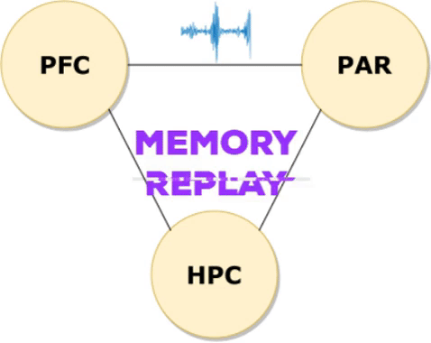

# Cortico-Hippocampal Network during Memory Consolidation  

MASTER THESIS PROJECT by: [Adrián Alemán Zapata](https://www.linkedin.com/in/adri%C3%A1n-alem%C3%A1n-zapata-b1b727b2/)  

:mortar_board: *Defended on 16th November 2018 at TU Eindhoven, The Netherlands.* 

<!--- --->

Contact: jraleman10@gmail.com :mailbox: 

:warning: Makes use of functions from [ADRITOOLS](https://github.com/Aleman-Z/ADRITOOLS) repository.

--------------------------------
## Main Folders: :file_folder: 
1. Load_ephys: Converts .continuous channels into downsampled (1kHz) .mat files. :floppy_disk:
2. Figures: Main functions for generating paper figures. :bar_chart: 
3. Granger: Implementation of Spectral Granger Causality. 
4. Ripple_selection: Detection and selection of ripples.
5. Pre_midterm: Scripts of tests performed prior to midterm presentation. 
--------------------------------
