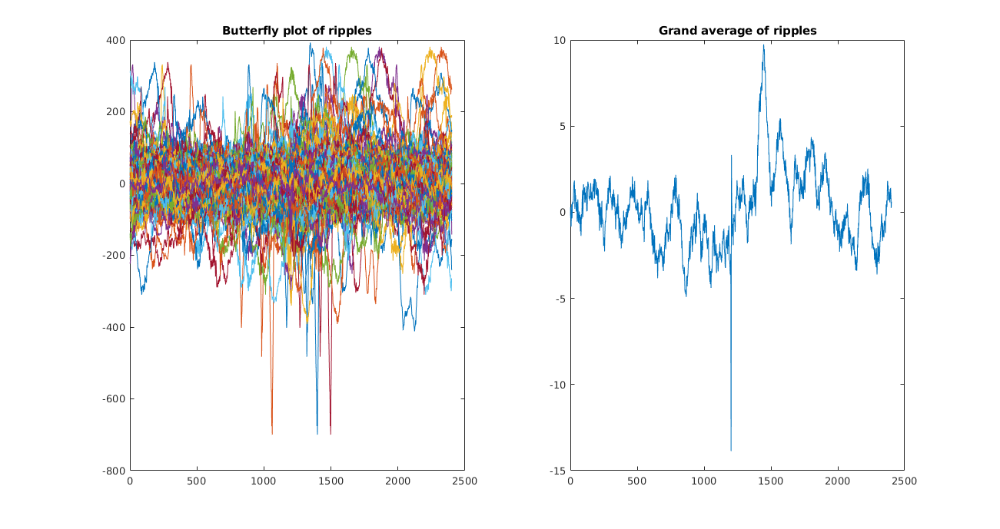

-Ripple Selection 
------------------

####  :link: Function Description: 

1. **max_outlier.m**: Looks for outliers among found ripples. When consecutive ripples occur, it only takes the first.  A ripple is considered an outlier when its maximum value is  more than 1.5 interquartile ranges above the upper quartile or below the lower quartile.

2. **max_outlier_consecutive.m**: Looks for outliers among found ripples. A ripple is considered an outlier when its maximum value is  more than 1.5 interquartile ranges above the upper quartile or below the lower quartile.

3. **select_rip.m**: Selects strongests ripples among those found.*

4. **sort_rip.m**: Sort ripples in descendent order according to their max value. The first 10 highest values are assumed to be outliers and removed.*

5. **select_quinientos.m**: Selects strongests 500 ripples among those found.*

6. **butterfly_plot.m**: Generates butterfly plot of all ripples and their grand average.

7. **rat24_artifact.m**: Script with several test ran to remove artifacts from Rat 24.

