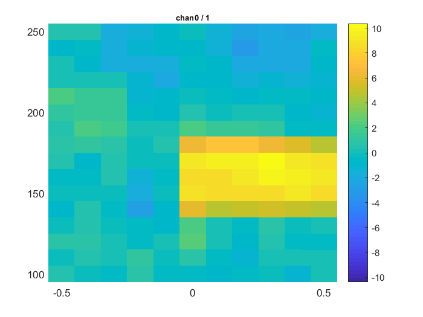
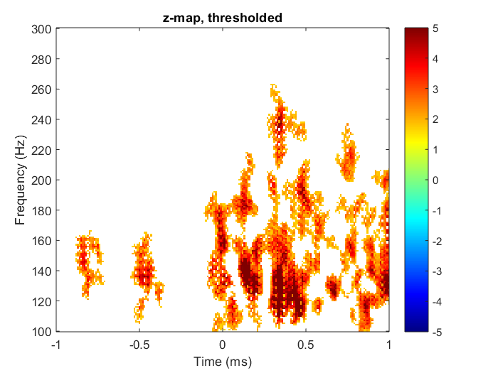
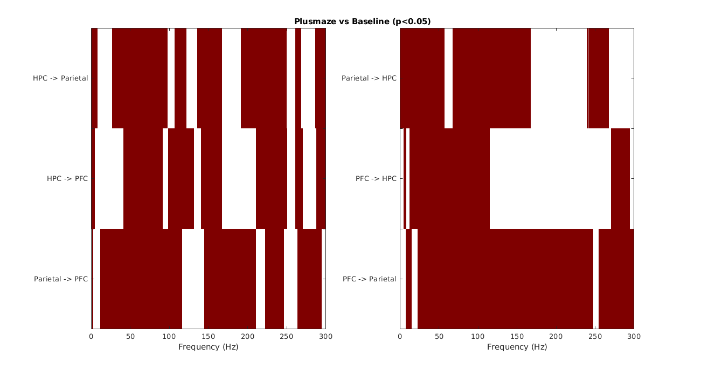
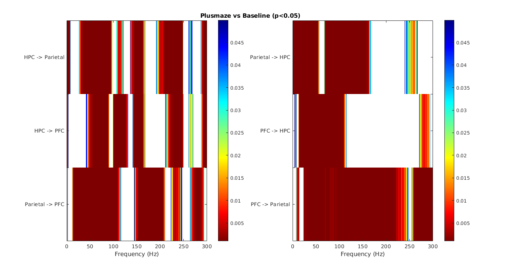

### Statistical Analysis

:dart:Example code for Cluster statistics.
* **compute_statistics.m**

:dart:Max-pixel-based method

* **stats_high.m:**  :heavy_check_mark:
*Computes permutation test statistics using Fieldtrip arranged samples as inputs.*

* **stats_high2.m:**  
*Computes permutation test statistics using 2 matrixes as inputs.*

:dart:Cluster-based method*

* **stats_between_trials.m:** :heavy_check_mark:
*Used on Figure 3 for statistics on spindle range.  Uses 'ft_statfun_indepsamplesT'.* 

* **stats_between_trials2.m:**
*Similar to function above but instead uses 'ft_statfun_depsamplesT'. Not used on this experiment*

* **stats_between_trials10.m:**
*Identical as above. Used when window is 10 sec long before and after.*  

* **stats_freq2.m:**  
*Identical copy of **stats_freq1.m**. Uses a matrix of zeros as baseline. Just for testing.* 

:dart:Permutation test
* **perm_stats.m:**
*Performs two-tailed permutation test on granger causality values per frequency from two different conditions.*  

* **figure_binary.m:**
*Plots significant frequencies that differ between conditions.*  
    

* **figure_pval.m:**
*Plots significant frequencies and their p-values that differ between conditions.*  
    

*Actual computation is performed by Fieldtrip function: [ft_freqstatistics.m](http://www.fieldtriptoolbox.org/reference/ft_freqstatistics)

